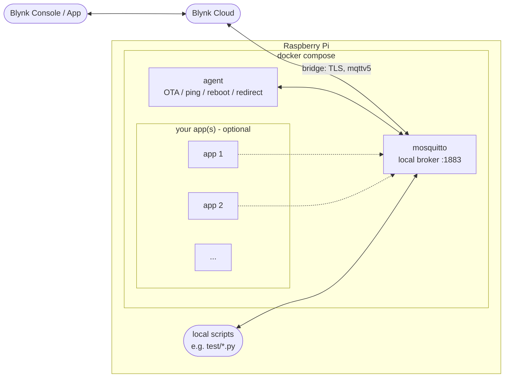

# Blynk Agent for Raspberry Pi

Turns a Raspberry Pi into a Blynk device: a local MQTT broker bridges to Blynk Cloud, and an agent manages the device's own `docker-compose.yml` via Blynk OTA.

## Install

```
curl -fsSL https://raw.githubusercontent.com/anthony-blynk/blynk-agent-raspberry-pi/master/install.sh | bash
```

Installs Docker if needed, prompts for this device's Blynk server/template/auth token, and starts the stack. This only needs to run once per Pi — see [Updating](#updating).

## How it works



- **mosquitto** and **agent** both run as Docker containers, managed by the same `docker-compose.yml` the agent OTA-updates.
- **mosquitto** bridges the local broker to Blynk Cloud. Only mosquitto holds the Blynk auth token (for that cloud bridge connection) - anything else on the Pi just connects to the local broker on plain, unauthenticated MQTT. Your own apps never need to know about Blynk credentials at all.
- That local broker is only reachable on the Pi itself (`127.0.0.1:1883`) - nothing outside the Pi can connect to it.
- **agent** subscribes to Blynk's downlink control topics: `downlink/ota/json` (downloads, validates, and applies a new `docker-compose.yml`, with automatic rollback on failure), `downlink/ping`, `downlink/reboot`, and `downlink/redirect`.
- You can add your own service(s) to `docker-compose.yml` alongside mosquitto and agent, and/or just run your own programs directly on the Pi (outside Docker) - either way, they talk to the local broker, which is already bridged to Blynk. See `test/` for minimal pub/sub examples.
- Blynk's own topics (`ds/#`, `downlink/#`, etc. - see [the MQTT API docs](https://docs.blynk.io/en/blynk.cloud-mqtt-api/device-mqtt-api/topic-structure)) are what actually reach Blynk Cloud through the bridge. Your apps are free to use any other topics on the local broker too - those just stay local and never interact with Blynk at all.

## Updating

Updates go through Blynk OTA, not by re-running `install.sh`. Grab the latest [`docker-compose.yml`](docker-compose.yml) (merging in your own additions if you've customized it) and upload it through your Blynk console's OTA feature for that device.
