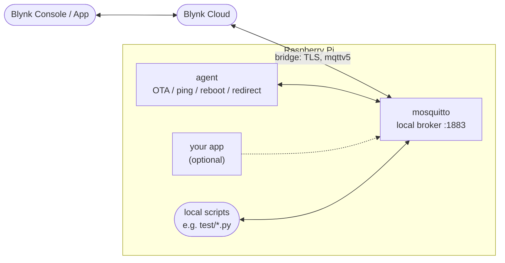

# Blynk Agent for Raspberry Pi

Turns a Raspberry Pi into a Blynk device: a local MQTT broker bridges to Blynk Cloud, and an agent manages the device's own `docker-compose.yml` via Blynk OTA.

## Install

```
curl -fsSL https://raw.githubusercontent.com/anthony-blynk/blynk-agent-raspberry-pi/master/install.sh | bash
```

Installs Docker if needed, prompts for this device's Blynk server/template/auth token, and starts the stack. This only needs to run once per Pi — see [Updating](#updating).

## How it works



- **mosquitto** bridges the local broker to Blynk Cloud, so anything on the Pi can publish/subscribe to datastreams over plain local MQTT without ever touching cloud credentials.
- **agent** subscribes to Blynk's downlink control topics: `downlink/ota/json` (downloads, validates, and applies a new `docker-compose.yml`, with automatic rollback on failure), `downlink/ping`, `downlink/reboot`, and `downlink/redirect`.
- Your own containers or local scripts can be added alongside — see `test/` for minimal pub/sub examples.

## Updating

Updates go through Blynk OTA, not by re-running `install.sh`. Grab the latest [`docker-compose.yml`](docker-compose.yml) (merging in your own additions if you've customized it) and upload it through your Blynk console's OTA feature for that device.
