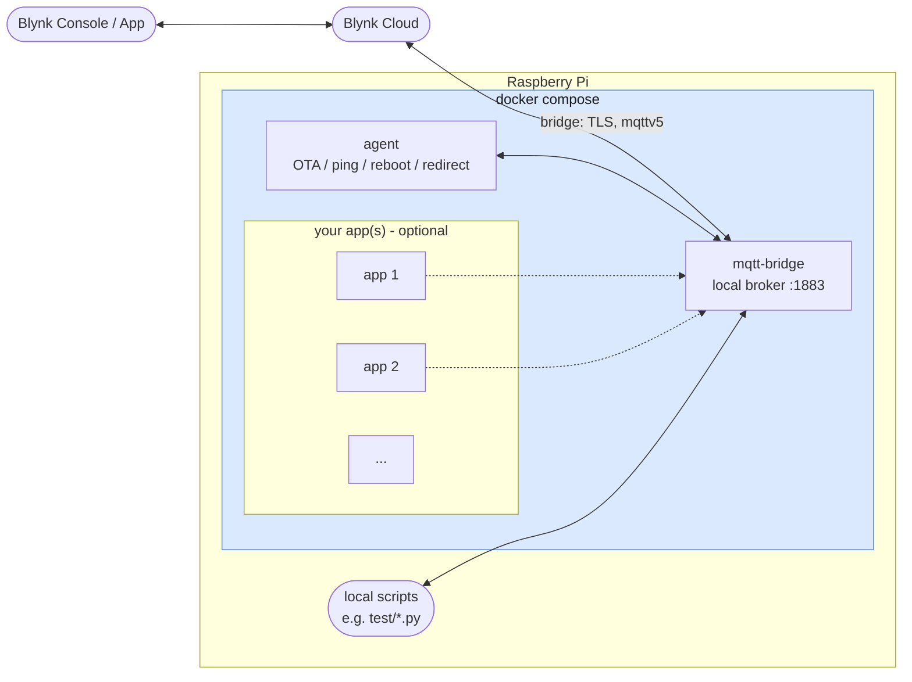

# Blynk Edge Agent

Turns a Raspberry Pi into a Blynk device. A local MQTT broker acts as a bridge to Blynk Cloud and handles the connection complexity — auth, certificates, all of it — so every other service on the Pi just speaks plain local MQTT, while the whole stack stays updatable over the air through Blynk OTA.

## Install

Get up and running on a fresh Pi with a single command:

```
curl -fsSL https://raw.githubusercontent.com/anthony-blynk/blynk-edge-agent/master/install.sh | bash
```

Installs Docker if needed, prompts for this device's Blynk server/template/auth token, and starts the stack. This only needs to run once per Pi — see [Updating](#updating).

Blynk Enterprise clients running their own server and a branded mobile app can also set a vendor prefix at install time (`BLYNK_VENDOR_PREFIX`, defaults to `Blynk`) - it replaces "Blynk" in the BLE-advertised device name (e.g. `Blynk Device-971K` → `Acme Device-971K`) and the provisioning `vendor` field, so the device never shows unbranded "Blynk" text during setup.

## How it works



- **mqtt-bridge** and **agent** both run as Docker containers, managed by the same `docker-compose.yml` the agent OTA-updates.
- **mqtt-bridge** bridges the local broker to Blynk Cloud. Only mqtt-bridge holds the Blynk auth token (for that cloud bridge connection) - anything else on the Pi just connects to the local broker on plain, unauthenticated MQTT. Your own apps never need to know about Blynk credentials at all.
- That local broker is only reachable on the Pi itself (`127.0.0.1:1883`) - nothing outside the Pi can connect to it.
- **agent** subscribes to Blynk's downlink control topics: `downlink/ota/json` (downloads, validates, and applies a new `docker-compose.yml`, with automatic rollback on failure), `downlink/ping`, `downlink/reboot`, `downlink/redirect`, and `downlink/reconfigure`.
- You can add your own service(s) to `docker-compose.yml` alongside mqtt-bridge and agent, and/or just run your own programs directly on the Pi (outside Docker) - either way, they talk to the local broker, which is already bridged to Blynk. See `test/` for minimal pub/sub examples.
- Blynk's own topics (`ds/#`, `downlink/#`, etc. - see [the MQTT API docs](https://docs.blynk.io/en/blynk.cloud-mqtt-api/device-mqtt-api/topic-structure)) are what actually reach Blynk Cloud through the bridge. Your apps are free to use any other topics on the local broker too - those just stay local and never interact with Blynk at all.

## WiFi provisioning

A device with no stored Blynk auth token (`blynk.env` left blank during `install.sh`, or after a `downlink/reconfigure`) advertises over Bluetooth LE and runs the Blynk app's provisioning flow ("Blynk.Inject"): the app scans, connects, requests the device's real network interfaces, and - for a WiFi interface - requests a scan and lets the user pick an SSID, enter a password, and optionally set a static IP. The device configures WiFi and the Blynk connection through NetworkManager over D-Bus (the host's, not the container's own - reached over the same D-Bus socket already used for BlueZ), reporting live status back over the same BLE link the whole time, including specific failure reasons (e.g. a wrong password) so the app can prompt for corrected credentials without needing to reconnect.

If a previously-provisioned device later loses connectivity for a sustained period (WiFi credentials changed at the router, for example), it automatically re-enters this same BLE provisioning flow **in place** - without a reboot, and without discarding the already-stored Blynk auth token - so the app only needs to supply corrected network info. This is checked roughly every minute against `$SYS/broker/connection/blynk-bridge-{template_id}/state` (mqtt-bridge's own bridge connection-state notification), and only triggers after the bridge has been down continuously for several minutes, to ride out brief blips rather than reprovisioning on the first hiccup.

## Diagnostics and system info

At startup, the agent publishes static system facts as datastreams: device model, OS, kernel version, architecture, total memory, total disk (`AgentDeviceModel`, `AgentOS`, `AgentKernel`, `AgentArchitecture`, `AgentTotalMemory`, `AgentTotalDisk`). These are plain datastreams rather than Blynk's metadata fields - metadata is the better semantic fit for static facts like these, but dashboard widgets currently can't display metadata fields, only datastreams, so datastreams are what's actually usable on the dashboard.

Live health metrics - CPU usage, memory usage, disk usage, temperature (`AgentCPUUsage`, `AgentMemUsage`, `AgentDiskUsage`, `AgentTemperature`) - report every 60s while enabled via a console Switch widget bound to an `AgentDiagnosticsEnabled` datastream. The agent asks Blynk for the current on/off state each time it (re)starts rather than assuming it's off, so a restarted agent picks back up whatever you last set rather than silently going quiet. All metrics are read directly from `/proc`, `/sys`, and Python's standard library - no extra dependency.

To set it up, create these datastreams for the device's template: the six system-info fields above (String), `AgentCPUUsage`/`AgentMemUsage`/`AgentDiskUsage` (Double, 0-100), `AgentTemperature` (Double, 0-110), and `AgentDiagnosticsEnabled` (Integer, 0-1, with a Switch widget). Add Label/Gauge/History Graph widgets bound to whichever of these you want visible on the dashboard.

## Remote terminal (on by default while this is a demo project)

Blynk's [Terminal widget](https://docs.blynk.io/en/blynk.console/widgets-console/terminal) can give you a real shell on the device, entirely over the same outbound connection the agent already uses - no inbound port, no VPN, nothing exposed to the network beyond what's already there for Blynk itself. Commands run via `nsenter` into the host's own namespaces, so `pwd`/`ls`/`ps`/etc. reflect the actual Pi, not just the agent's own container.

This is a real shell with real access, so it's behind two independent switches rather than one:

- **Capability** - a `docker-compose.yml` environment variable (`AGENT_TERMINAL_ENABLED` on the `agent` service), only changeable via an OTA push or a manual edit on the device itself. This is deliberate: compromising your Blynk account credentials alone should never be enough to get a shell on a device that never had this turned on - that requires a second, harder action. **Currently defaults to `true` in the tracked `docker-compose.yml`**, so the feature is obvious and easy to try while this project is still a demo with no production fleets - set it to `false` (or remove the line) for any device you don't want this on at all, since at that point no Switch toggle in Blynk can turn it back on without an OTA push or a manual edit here.
- **Session** - a Switch widget bound to an `AgentTerminalEnabled` datastream, for quick on/off without needing an OTA push every time you actually want to use it. This is the one that matters day to day - turn it off when you're not actively using the terminal.

Both need to be on for commands to run - the terminal always replies with a `[terminal disabled: ...]` message explaining which one is off, rather than silently doing nothing either way.

To set it up, create two datastreams for the device's template - `AgentTerminal` (String, with a Terminal widget) and `AgentTerminalEnabled` (Integer, 0-1, with a Switch widget). The capability itself is already on by default (see above); flip the Switch widget on when you want to actually use it.

## Updating

Updates go through Blynk OTA, not by re-running `install.sh`. Grab the latest [`docker-compose.yml`](docker-compose.yml) (merging in your own additions if you've customized it) and upload it through your Blynk console's OTA feature for that device.

## Troubleshooting

### BLE provisioning: device won't advertise / registering the advertisement fails

Raspberry Pi kernels around `6.18.34` have a Bluetooth regression that breaks BLE advertising entirely - the agent logs `Failed to register advertisement`, and `sudo btmon` or `sudo journalctl -u bluetooth` shows `Invalid Parameters (0x0d)` on `Add Extended Advertising Data`. Confirmed and fixed upstream: [raspberrypi/linux#7473](https://github.com/raspberrypi/linux/issues/7473), fix commit `58d810354de1b`, first shipped in Linux **6.18.36**.

- Check `apt-cache policy raspberrypi-kernel` (or `linux-image-*`) - if a version ≥6.18.36 is offered, a normal `sudo apt upgrade` fixes this and nothing else below is needed.
- If a fixed version isn't in apt yet, pull it directly:
  ```
  sudo rpi-update
  sudo reboot
  ```
- To instead roll back to the exact kernel this project was tested against while waiting for a fixed release (`6.12.47+rpt`, confirmed working):
  ```
  sudo rpi-update 6d1da66a7b1358c9cd324286239f37203b7ce25c
  sudo reboot
  ```
  That commit is from [raspberrypi/rpi-firmware](https://github.com/raspberrypi/rpi-firmware), not `raspberrypi/firmware` - the two repos look similar but only `rpi-firmware` commits work with `rpi-update`. After rolling back, hold the broken kernel packages so a routine `apt upgrade` doesn't reintroduce the bug (check `apt list --installed | grep linux-image` for your exact package names first):
  ```
  sudo apt-mark hold linux-image-6.18.34+rpt-rpi-2712 linux-image-6.18.34+rpt-rpi-v8 linux-image-rpi-2712 linux-image-rpi-v8
  ```
